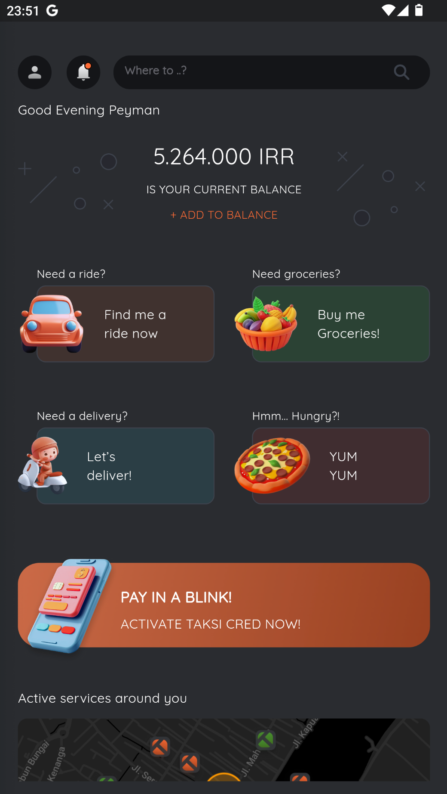
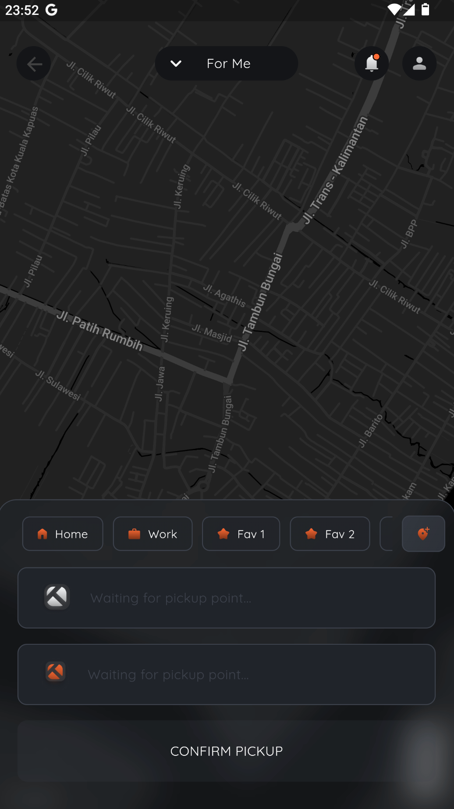
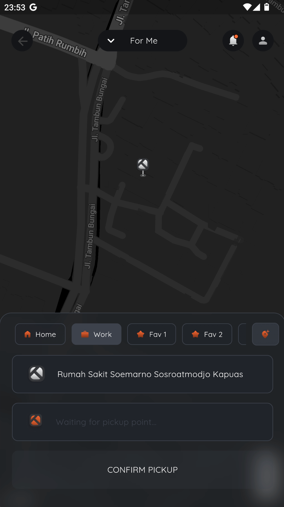
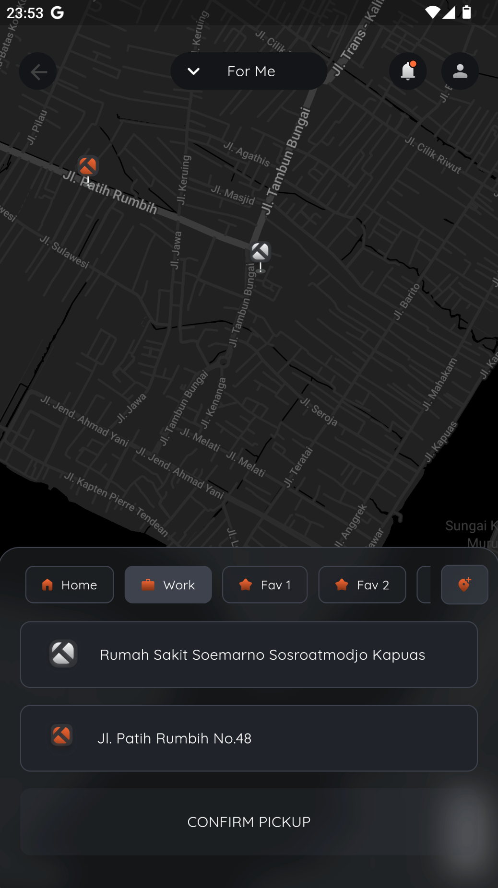
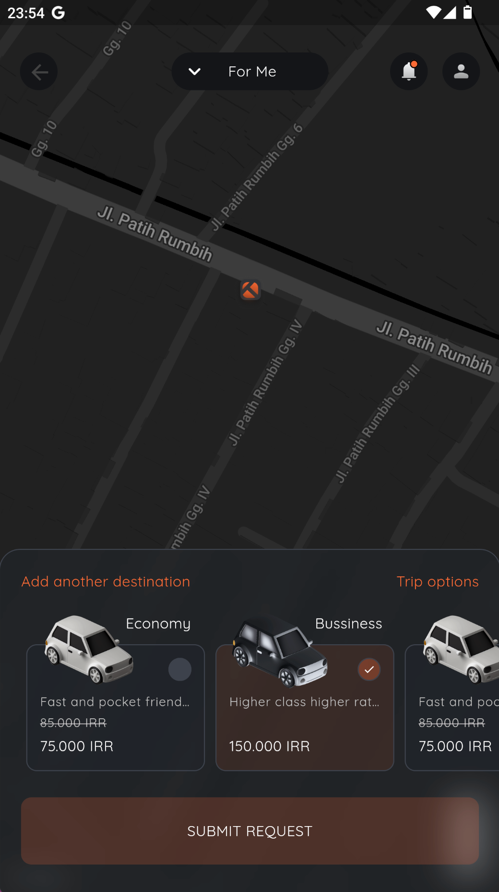
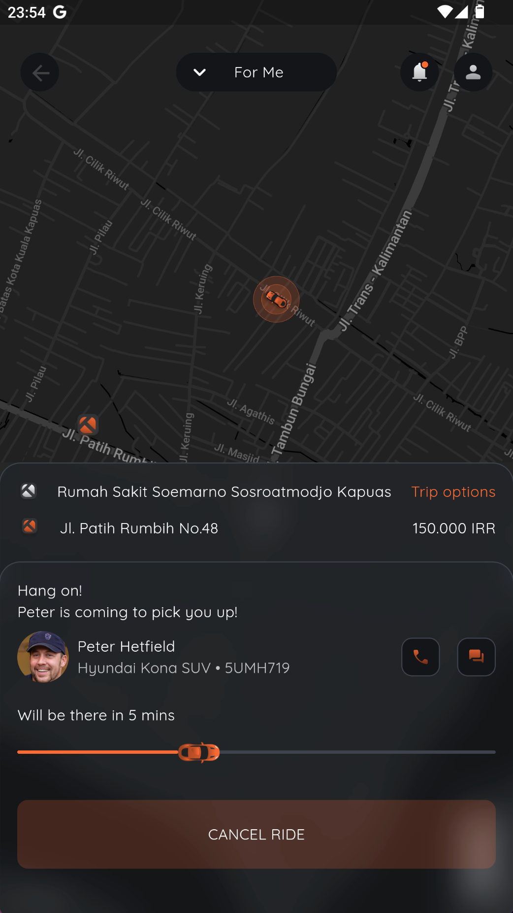

<p align="center">
    
    
    
    

</p>

# Flutter Taksi UI

**Flutter Taksi UI** is a modern and responsive mobile application developed using Flutter, designed to provide an intuitive and efficient taxi booking experience. This app is based on slicing from a Figma design, optimized for mobile screens. With a clean and user-friendly interface, it allows users to easily book, track, and manage taxi rides.

The application features modern design elements, including interactive maps, smooth transition animations, and custom icons for each vehicle type. Key functionalities such as selecting pick-up/destination locations, fare estimation, and a list of available vehicles are designed to ensure a seamless user experience. Powered by Flutter, the app guarantees fast and responsive performance across various devices, making it an ideal solution for developers aiming to create aesthetically pleasing and high-performance taxi booking applications.

<a href="https://github.com/sh4dowByte/flutter_ui_taksi/releases/download/v1.0.0%2B1-4/app-release.apk">
    
</a>

## 🎨 Design

The design of this application is based on the provided Figma file. The slicing process was carried out meticulously to ensure the application accurately represents the design.

## 🚀 Feature

The application features:

- **Google Maps Integration**: Interactive maps for selecting pick-up.
- **Responsive Design**: Supports various screen sizes with responsive UI elements.
- **Seamless Navigation**: Implements navigation using Flutter Navigator for a smooth user flow.
- **Reusable Components**: Modular components for easier development and maintenance.

## 🛠️ Technologies

This project is built using the following technologies:

- **[Flutter](https://flutter.dev/)**: A framework for cross-platform application development.
- **[Dart](https://dart.dev/)**: The primary programming language for Flutter.
- **[Google Fonts](https://fonts.google.com/)**: For custom font integration.
- **[Figma](https://www.figma.com/)**: Used as the application's design reference.

## 📂 Folder Structure

```plaintext
.
├── assets/              # Contains images, icons, and other assets  
├── lib/  
│   ├── config/          # Application configuration (theme, routes, etc.)  
│   ├── screens/         # Main application pages  
│   ├── widgets/         # Reusable UI components  
│   ├── main.dart        # Main application file  
└── pubspec.yaml         # Flutter project configuration  
```

## ⚙️ Setup Instructions

To run this application successfully, please follow the setup steps below:

### 1. Update API Keys in `AndroidManifest.xml`

Before running the application, you need to replace the placeholder for your API key in the `AndroidManifest.xml` file.

1. Open `android/app/src/main/AndroidManifest.xml`.
2. Locate the line with the placeholder `YOUR_MAPS_API_KEY` in the `<meta-data>` tag.
3. Replace `YOUR_MAPS_API_KEY` with your actual API key.

Example:

```xml
<meta-data
    android:name="com.google.android.geo.API_KEY"
    android:value="YOUR_ACTUAL_API_KEY" />
```

### 2. Update API Keys in `google_map_service.dart`

Before running the application, you need to replace the placeholder for your API key in the `google_map_service.dart` file.

1. Open ` lib/services/google_map_service.dart`.
2. Replace `YOUR_MAPS_API_KEY` with your actual API key.


## 🖼️ Screenshot

|  |                                                |
| ---------------------------------------------- | ---------------------------------------------- |
|  |  |
|  |  |
|  |                                                |

## License

This project is licensed under the Creative Commons Attribution-NonCommercial 4.0 International (CC BY-NC 4.0).
You are free to use this project for personal or educational purposes, but commercial use is not allowed.

For more details, refer to the [full license text](LICENSE).

## Disclaimer

The design of this application is based on a free Figma template available in the Figma Community, originally created by **[Peyman Shafiee]**. All rights to the original design are retained by the respective creator. This implementation is intended solely for educational and non-commercial purposes.

This project utilizes a design sourced from the Figma Community, created by **[Peyman Shafiee]**. Licensing terms of the original design may apply. Please review the original Figma design [here](https://www.figma.com/community/file/1356907148776412863) to ensure compliance with its terms before utilizing this project in any capacity.
